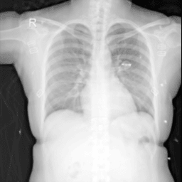
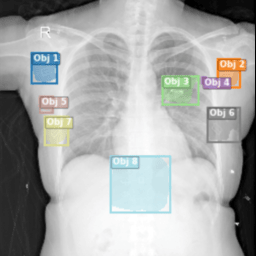
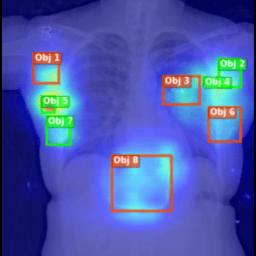

# Explainable Artificial Intelligence for Image Quality Assessment

## Overview

This project provides a comprehensive framework for explainable artificial intelligence (XAI) applied to image quality assessment (IQA), with a focus on medical imaging (Chest X-rays). It combines deep learning-based segmentation, saliency mapping, and large language model (LLM) explanations to deliver both quantitative and interpretable assessments of image quality.

| **Original Image** | **Segmentation Mask** | **Saliency Overlay** |
|:------------------:|:---------------------:|:---------------------:|
|  |  |  |


## DeepLabV3+ Model Results: Quantitative & Qualitative (with Baseline Comparison)

### 1. Quantitative Results

#### **A. Classification Performance Comparison**

| Model                | Class Label   | Accuracy | Precision | Recall  | F1-Score | Specificity |
|----------------------|--------------|----------|-----------|---------|----------|-------------|
| **ResNet34**         | Affected     | 0.8460   | 0.8089    | 0.9060  | 0.8547   | 0.7860      |
|                      | Normal       | 0.8460   | 0.8932    | 0.7860  | 0.8362   | 0.9060      |
| **EfficientNet-B0**  | Affected     | 0.8600   | 0.8435    | 0.8840  | 0.8633   | 0.8360      |
|                      | Normal       | 0.8600   | 0.8782    | 0.8360  | 0.8566   | 0.8840      |
| **DeepLabV3+**       | Object       | 0.8030   | 0.9662    | 0.6280  | 0.7612   | 0.9780      |
|                      | No Object    | 0.8030   | 0.7244    | 0.9780  | 0.8323   | 0.6280      |


#### **B. Segmentation Metrics (DeepLabV3+ 5-Fold CV)**

| Metric                  | Mean ± Std      |
|-------------------------|-----------------|
| Dice Coefficient (DSC)  | 0.6482 ± 0.0118 |
| Recall                  | 0.7008 ± 0.0118 |
| Boundary IoU            | 0.4943 ± 0.0061 |
| ASSD (px)               | 15.90 ± 1.53    |
| HD95 (px)               | 57.20 ± 5.33    |

#### **C. Explainability (XAI) Metrics**

| Model         | XAI Method        | Pointing Game Accuracy (PGA) | DAUC (Faithfulness) | Eval Time (s) |
|---------------|-------------------|------------------------------|---------------------|---------------|
| ResNet34      | Grad-CAM          | 0.186                        | —                   | —             |
| ResNet34      | NormGrad (all)    | 0.206                        | —                   | —             |
| EfficientNet  | Grad-CAM          | 0.102                        | —                   | —             |
| EfficientNet  | NormGrad (all)    | 0.178                        | —                   | —             |
| DeepLabV3+    | Grad-CAM          | 0.512                        | 0.0267 ± 0.0063     | 1113.74       |
| DeepLabV3+    | NormGrad Order 0  | 0.260                        | 0.0399 ± 0.0063     | 1127.11       |
| DeepLabV3+    | NormGrad Order 1  | 0.268                        | 0.0398 ± 0.0064     | 5662.65       |


### 2. Qualitative Results

#### **A. Study (50 images), Scores: 1 (Poor/Bad) to 5 (Excellent/Good).**

| Dimension                        | Mean Score | Std. Dev. |
|-----------------------------------|------------|-----------|
| Overall Score Analysis Quality    | 4.28       | 1.23      |
| Segmentation Quality (Visual)     | 4.48       | 0.95      |
| Heatmap Quality (Saliency)        | 4.62       | 0.83      |
| Model Text Quality (LLM)          | 4.80       | 0.57      |


---

### 3. Key Insights

- **DeepLabV3+** outperforms classification baselines in explanation localization and precision, making it more trustworthy for clinical use.
- **Annotation errors** in the dataset lower reported recall and DSC, but manual review confirms higher true performance.
- **Grad-CAM** is the most effective and efficient XAI method for this segmentation task.
- **Qualitative feedback** confirms the practical utility and interpretability of both visual and textual explanations.

---


## Features

- **Deep Learning Segmentation:** Automated detection of foreign objects or artifacts in medical images using state-of-the-art model (DeepLabV3+).
- **Explainability (XAI):** Generation of saliency maps (NormGrad, Grad-CAM) to visualize model decision regions.
- **LLM-Based Explanations:** Integration with local LLMs (GPT4All) to provide human-readable summaries and technical reports.
- **Web Application:** Interactive Flask-based web interface for image upload, analysis, visualization, and PDF report export.
- **Training & Evaluation Pipelines:** Scripts for model training, testing, and visualization.
- **Modular Architecture:** Well-organized codebase with clear separation of training, testing, visualization, and web interface components.

## Installation

1. **Clone the repository:**
   ```bash
   git clone https://github.com/MoncefDj/Explainable-Artificial-Intelligence-for-Image-Quality-Assessment.git
   cd Explainable-Artificial-Intelligence-for-Image-Quality-Assessment
   ```

2. **Install Python dependencies:**
   ```bash
   pip install -r "Model WebApp Interface\website.2.0.0\requirements.txt"
   ```
   *(For training/visualization, see requirements in respective subfolders.)*

3. **(Optional) Download LLM model for explanations:**
   - If using LLM explanations, follow instructions in the web app README to download or configure the LLM model.

## Usage

### Web Application

1. **Start the web server:**
   ```bash
   cd "Model WebApp Interface\website.2.0.0"
   python run.py
   ```
2. **Open your browser:**  
   Visit `http://127.0.0.1:5001` (or the ngrok URL if enabled).

3. **Analyze an image:**
   - Upload or select an image.
   - View segmentation, saliency, and quality scores.
   - Optionally, generate an AI explanation and export a PDF report.

### Training & Testing

- **Train a model:**
  ```bash
  cd DeepLabV3Plus/Train
  python main.py
  ```
- **Test a model:**
  ```bash
  cd DeepLabV3Plus/Test
  python main.py
  ```
- **Visualization & LLM Analysis:**
  ```bash
  cd DeepLabV3Plus/VisEng
  python main.py
  ```

## Folder Structure

```
Explainable-Artificial-Intelligence-for-Image-Quality-Assessment/
├── DeepLabV3Plus/
│   ├── Train/        # Training pipeline
│   ├── Test/         # Testing/inference pipeline
│   ├── VisEng/       # Visualization & explainability
│   └── Evaluation/   # XAI evaluation framework and metrics
│       └── xai_evaluation_framework.py # Script for faithfulness and localization metrics
├── Model WebApp Interface/
│   └── website.2.0.0/  # Flask web application
├── re-implemetations/  # Additional model implementations
├── Dataset/            # Dataset preparation scripts
├── images/
└── README.md
```

## Technologies & Dependencies

- **Python 3.8+**
- **Deep Learning:** PyTorch, segmentation-models-pytorch
- **Web:** Flask, HTML/CSS/JS (Bootstrap, Marked.js, MathJax, Highlight.js)
- **Image Processing:** OpenCV, Albumentations, Matplotlib, Pillow
- **LLM Integration:** GPT4All (optional)
- **PDF Generation:** FPDF2
- **Other:** pandas, numpy, pyngrok (optional for public sharing)

See each subfolder's `requirements.txt` for details.


## License

This project is licensed under the [MIT License](./Model%20WebApp%20Interface/website.2.0.0/LICENSE).

## Credits

Developed by Sadoudi Abdessmad & Djezzar Moncef (2025).  
Includes open-source components (see respective subfolders for details).
